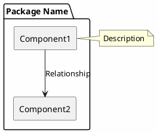
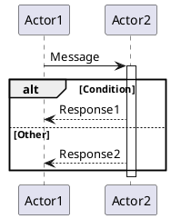

# PlantUML Documentation Guidelines

## Common Syntax Errors to Avoid

- **Don't use `!define RECTANGLE class`** - Invalid syntax
- **Don't mix diagram types** - Sequence diagrams can't use activity diagram if/then syntax
- **Always declare all participants** - Reference only declared participants in sequence diagrams
- **Place notes outside component definitions** - Use `note right of` instead of inline notes

## Correct Patterns

### Component Diagrams

### Sequence Diagrams

## Best Practices

- Place all PlantUML diagrams at the bottom of documentation
- Use descriptive section headers before each diagram
- Test diagrams in a PlantUML viewer before committing
- Keep diagrams focused on single concepts
